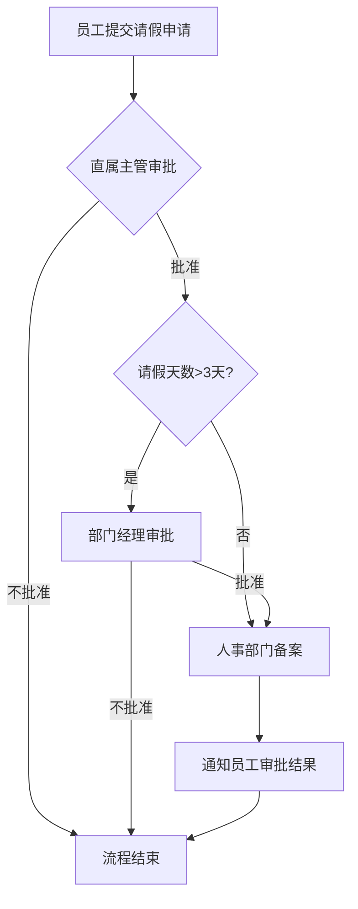

# 请假审批流程图

## 流程图

```mermaid
flowchart TD
    A[员工提交请假申请] --> B{直属主管审批}
    B -->|批准| C{请假天数>3天?}
    B -->|不批准| Z[流程结束]
    C -->|是| D[部门经理审批]
    C -->|否| E[人事部门备案]
    D -->|批准| E
    D -->|不批准| Z
    E --> F[通知员工审批结果]
    F --> Z
```
